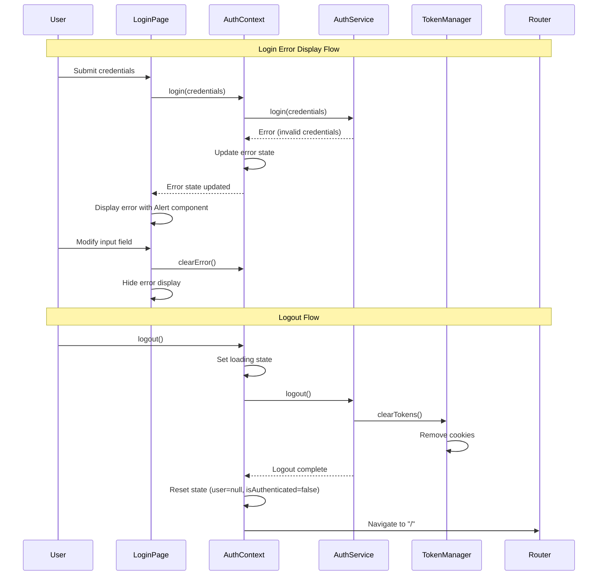

# Design Document: Authentication UX Improvements

## Overview

This design enhances the authentication user experience in the Next.js application by implementing three critical improvements: a robust logout flow with complete token cleanup and navigation, enhanced error display on the login page, and consistent application of the design system across authentication interfaces.

The implementation leverages the existing auth infrastructure (auth-context, auth-service, token-manager) and extends it with improved UX patterns. The design focuses on user-facing improvements without requiring changes to the backend API.

## Architecture

### Component Interaction Flow



### State Management

The Auth_Context manages authentication state using a reducer pattern with the following state transitions:

1. **Logout Initiated**: `isLoading: true, isAuthenticated: true`
2. **Tokens Cleared**: `isLoading: true, isAuthenticated: true` (tokens removed from storage)
3. **State Reset**: `isLoading: false, isAuthenticated: false, user: null, error: null`
4. **Navigation**: Redirect to Home_Page after state reset

## Components and Interfaces

### Enhanced Auth Context

The existing AuthContext will be extended with improved logout handling:

```typescript
// Enhanced logout function in auth-context.tsx
const logout = useCallback(async () => {
  try {
    dispatch({ type: 'SET_LOADING', payload: true })
    
    // Call auth service to clear tokens and notify server
    await authService.logout()
    
    // Reset all authentication state
    dispatch({ type: 'RESET_STATE' })
    
    // Navigate to home page
    router.push('/')
  } catch (error) {
    // Even if logout fails, clear local state and navigate
    console.error('Logout error:', error)
    dispatch({ type: 'RESET_STATE' })
    router.push('/')
  }
}, [router])
```

### Error Display Component

The Login_Page will use the existing Alert component from the design system for error display:

```typescript
// Error display pattern in login page
{error && (
  <Alert variant="destructive" className="mb-4">
    <AlertCircle className="h-4 w-4" />
    <AlertTitle>Authentication Failed</AlertTitle>
    <AlertDescription>{error}</AlertDescription>
  </Alert>
)}
```

### Enhanced Login Page Structure

```typescript
interface LoginPageState {
  username: string
  password: string
  fieldErrors: Record<string, string>
  isRedirecting: boolean
}

// Error clearing behavior
useEffect(() => {
  if (error) {
    clearError()
  }
  setFieldErrors({})
}, [username, password])
```

## Data Models

### Error State Model

```typescript
interface ErrorDisplayState {
  message: string
  type: 'validation' | 'authentication' | 'network' | 'server'
  visible: boolean
}
```

### Logout State Transitions

```typescript
type LogoutState = 
  | { phase: 'idle' }
  | { phase: 'clearing_tokens' }
  | { phase: 'resetting_state' }
  | { phase: 'navigating' }
  | { phase: 'complete' }
```

## Correctness Properties

A property is a characteristic or behavior that should hold true across all valid executions of a system—essentially, a formal statement about what the system should do. Properties serve as the bridge between human-readable specifications and machine-verifiable correctness guarantees.


### Property Reflection

After analyzing the acceptance criteria, I identified several redundant properties:

- Properties 5.3 and 5.4 (isAuthenticated=false and user=null) are subsumed by Property 5.2 (reset to initial unauthenticated state), since the initial state already defines these values
- Properties 1.1 and 1.2 (clearing tokens and clearing auth state) are both essential and non-redundant - they test different storage mechanisms
- Properties 2.4 and 2.5 can be combined into a single property about error clearing behavior

Consolidated properties focus on:
1. Token cleanup during logout
2. State management during logout
3. Navigation after logout
4. Logout idempotency
5. Error resilience during logout
6. Error display and clearing behavior
7. Error message security and clarity

### Correctness Properties

Property 1: Logout clears all tokens
*For any* authenticated user state, when logout is called, Token_Storage should contain no authentication tokens (access_token and refresh_token cookies should be removed)
**Validates: Requirements 1.1**

Property 2: Logout resets authentication state
*For any* authenticated user state, when logout completes, the Auth_Context state should match the initial unauthenticated state (user=null, isAuthenticated=false, error=null)
**Validates: Requirements 1.2, 5.2, 5.3, 5.4**

Property 3: Logout triggers navigation
*For any* authenticated user state, when logout completes successfully, the router should navigate to Home_Page ("/")
**Validates: Requirements 1.3**

Property 4: Logout is idempotent
*For any* authentication state, calling logout multiple times in succession should produce the same final state as calling it once
**Validates: Requirements 1.4**

Property 5: Logout clears tokens even on API failure
*For any* authenticated user state, when the logout API call fails, Token_Storage should still be cleared and Auth_Context should still be reset
**Validates: Requirements 1.5**

Property 6: Login errors are displayed
*For any* login attempt that fails, the Login_Page should display an error message using the Error_Display component
**Validates: Requirements 2.1, 2.2**

Property 7: Input changes clear errors
*For any* error state on Login_Page, when the user modifies the username or password field, the error should be cleared from display
**Validates: Requirements 2.4, 2.5**

Property 8: Error messages don't leak credential information
*For any* authentication failure due to invalid credentials, the error message should not contain the words "username" or "password" that would indicate which field was incorrect
**Validates: Requirements 4.1**

Property 9: Server errors include retry guidance
*For any* server error during authentication, the error message should contain guidance about retrying the operation
**Validates: Requirements 4.2**

Property 10: Validation errors are field-specific
*For any* validation error, the error should be associated with the specific field that failed validation
**Validates: Requirements 4.3**

Property 11: Logout sets loading state
*For any* authentication state, when logout is initiated, the Auth_Context should immediately transition to isLoading=true
**Validates: Requirements 5.1**

Property 12: Logout completes before navigation
*For any* logout operation, token clearing and state reset should complete before router.push is called
**Validates: Requirements 5.5**

## Error Handling

### Error Display Strategy

1. **Authentication Errors**: Display using Alert component with "destructive" variant
2. **Network Errors**: Show user-friendly message: "Unable to connect. Please check your connection and try again."
3. **Server Errors**: Show generic message: "Something went wrong. Please try again in a moment."
4. **Validation Errors**: Display inline below the relevant form field

### Error Message Mapping

```typescript
const getErrorMessage = (error: AuthError): string => {
  switch (error.type) {
    case 'unauthorized':
      return 'Invalid credentials. Please check your login information and try again.'
    case 'network':
      return 'Unable to connect. Please check your connection and try again.'
    case 'server':
      return 'Something went wrong. Please try again in a moment.'
    case 'validation':
      return error.message // Field-specific validation messages
    default:
      return 'An unexpected error occurred. Please try again.'
  }
}
```

### Error Clearing Logic

Errors are automatically cleared when:
- User modifies any form field (username or password)
- User explicitly dismisses the error (if dismissible)
- Successful login occurs

## Testing Strategy

### Dual Testing Approach

This feature requires both unit tests and property-based tests for comprehensive coverage:

- **Unit tests**: Verify specific error scenarios, component rendering, and integration points
- **Property tests**: Verify universal properties across all authentication states and error conditions

### Property-Based Testing Configuration

We will use **fast-check** (TypeScript/JavaScript property-based testing library) for property tests:

- Each property test will run a minimum of 100 iterations
- Tests will generate random authentication states, credentials, and error conditions
- Each test will be tagged with: **Feature: auth-ux-improvements, Property {number}: {property_text}**

### Test Coverage Areas

**Unit Tests**:
- Logout button click triggers logout function
- Error Alert component renders with correct variant
- Navigation occurs after logout
- Specific error messages for known error types
- Form field validation edge cases

**Property Tests**:
- Token cleanup across all authentication states (Property 1)
- State reset consistency (Property 2)
- Navigation behavior (Property 3)
- Logout idempotency (Property 4)
- Error resilience (Property 5)
- Error display behavior (Property 6, 7)
- Error message security (Property 8)
- Error message content (Property 9, 10)
- Loading state transitions (Property 11)
- Operation ordering (Property 12)

### Testing Tools

- **Jest**: Unit test framework
- **React Testing Library**: Component testing
- **fast-check**: Property-based testing library
- **MSW (Mock Service Worker)**: API mocking for error scenarios

## Implementation Notes

### Router Integration

The logout function requires access to Next.js router for navigation. This will be achieved by:
1. Importing `useRouter` from `next/navigation` in auth-context.tsx
2. Passing router instance to logout callback
3. Calling `router.push('/')` after state reset

### Design System Components

All UI improvements will use existing components from `components/ui/`:
- `Alert`, `AlertTitle`, `AlertDescription` for error display
- `Button` for logout actions
- `Input` with aria-invalid for field errors
- `Label` for form labels
- Existing loading spinner patterns

### Backward Compatibility

These changes enhance existing functionality without breaking changes:
- Existing logout functionality is extended, not replaced
- Error display is added to existing login page
- All changes are additive to the current auth flow
