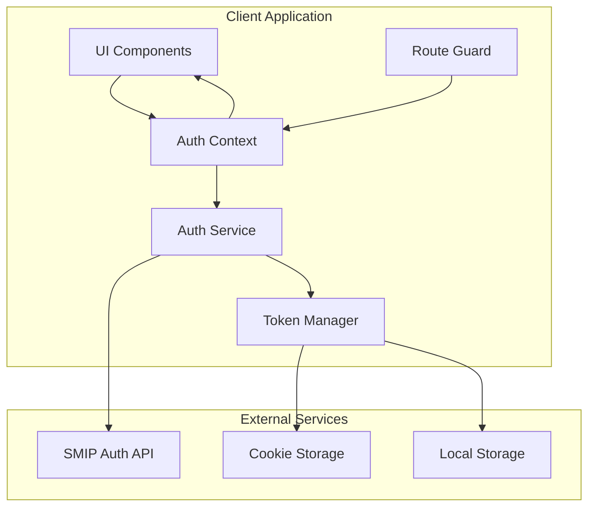

# Дизайн интеграции реальной аутентификации

## Обзор

Данный дизайн описывает архитектуру замены заглушек аутентификации на реальную интеграцию с API SMIP. Система будет построена на основе React Context для управления состоянием, HTTP клиента для взаимодействия с API, и системы защиты маршрутов для Next.js приложения.

Основные принципы:
- Централизованное управление состоянием аутентификации через React Context
- Автоматическое обновление токенов с использованием refresh token
- Безопасное хранение токенов в httpOnly cookies
- Защита маршрутов на уровне layout компонентов
- Обработка ошибок с пользовательскими сообщениями

## Архитектура



### Компоненты архитектуры

1. **Auth Context** - Централизованное управление состоянием аутентификации
2. **Auth Service** - HTTP клиент для взаимодействия с API аутентификации
3. **Token Manager** - Управление жизненным циклом токенов
4. **Route Guard** - Защита приватных маршрутов
5. **Error Handler** - Централизованная обработка ошибок аутентификации

## Компоненты и интерфейсы

### Auth Context

```typescript
interface AuthState {
  user: User | null
  isAuthenticated: boolean
  isLoading: boolean
  error: string | null
}

interface AuthContextType extends AuthState {
  login: (credentials: LoginCredentials) => Promise<void>
  logout: () => Promise<void>
  refreshAuth: () => Promise<void>
  clearError: () => void
}

interface User {
  username: string
  // Дополнительные поля пользователя будут добавлены по мере необходимости
}

interface LoginCredentials {
  username: string
  password: string
}
```

### Auth Service

```typescript
interface AuthService {
  login(credentials: LoginCredentials): Promise<AuthResponse>
  refreshToken(): Promise<AuthResponse>
  logout(): Promise<void>
}

interface AuthResponse {
  access_token: string
  refresh_token: string
}

interface ValidationError {
  loc: string[]
  msg: string
  type: string
}

interface ApiError {
  detail: ValidationError[]
}
```

### Token Manager

```typescript
interface TokenManager {
  setTokens(accessToken: string, refreshToken: string): void
  getAccessToken(): string | null
  getRefreshToken(): string | null
  clearTokens(): void
  isTokenExpired(token: string): boolean
}
```

### Route Guard

```typescript
interface RouteGuardProps {
  children: React.ReactNode
  fallback?: React.ReactNode
  redirectTo?: string
}
```

## Модели данных

### Токены аутентификации

```typescript
interface AuthTokens {
  accessToken: string
  refreshToken: string
  expiresAt: number // timestamp
}
```

### Состояние ошибок

```typescript
interface AuthError {
  type: 'network' | 'validation' | 'unauthorized' | 'server' | 'unknown'
  message: string
  field?: string // для ошибок валидации полей
}
```

### Конфигурация API

```typescript
interface ApiConfig {
  baseUrl: string
  endpoints: {
    auth: string
  }
  timeout: number
  retryAttempts: number
}
```

## Свойства корректности

*Свойство - это характеристика или поведение, которое должно выполняться во всех допустимых выполнениях системы - по сути, формальное утверждение о том, что система должна делать. Свойства служат мостом между человекочитаемыми спецификациями и машинно-проверяемыми гарантиями корректности.*

### Свойства после рефлексии

Основываясь на анализе критериев приемки, определены следующие ключевые свойства корректности:

**Свойство 1: API Integration Correctness**
*Для любых* валидных учетных данных, система должна правильно взаимодействовать с API аутентификации, отправляя корректно сформированные запросы и обрабатывая ответы
**Validates: Requirements 1.1, 1.2, 1.3**

**Свойство 2: Token Storage Security**
*Для любой* успешной аутентификации, Token_Manager должен сохранить токены в безопасном хранилище и обеспечить их правильное извлечение
**Validates: Requirements 2.1, 6.1**

**Свойство 3: Token Refresh Mechanism**
*Для любого* истекшего access_token, система должна автоматически использовать refresh_token для получения нового токена или корректно обработать неудачу
**Validates: Requirements 2.2, 2.3, 3.3**

**Свойство 4: Route Protection**
*Для любого* пользователя и защищенного маршрута, Route_Guard должен разрешить доступ только аутентифицированным пользователям и перенаправить неаутентифицированных на страницу входа
**Validates: Requirements 3.1, 3.2, 3.4**

**Свойство 5: Context State Management**
*Для любого* изменения состояния аутентификации, Auth_Context должен корректно уведомить все подписанные компоненты и предоставить актуальные данные
**Validates: Requirements 4.1, 4.2, 4.3, 4.4, 4.5**

**Свойство 6: Error Handling**
*Для любой* ошибки аутентификации, система должна отобразить соответствующее пользовательское сообщение и корректно обработать ошибку
**Validates: Requirements 5.1, 5.2, 5.3, 5.4, 5.5**

**Свойство 7: Logout Cleanup**
*Для любого* действия выхода из системы, система должна полностью очистить все токены и состояние аутентификации
**Validates: Requirements 2.4**

**Свойство 8: Authentication State Initialization**
*Для любого* запуска приложения, система должна правильно определить и восстановить состояние аутентификации на основе сохраненных токенов
**Validates: Requirements 2.5, 4.4**

**Свойство 9: Secure Communication**
*Для любого* запроса к API, система должна использовать HTTPS соединение и правильный формат заголовков авторизации
**Validates: Requirements 6.2, 6.3**

## Обработка ошибок

### Типы ошибок

1. **Сетевые ошибки** - проблемы с подключением к серверу
2. **Ошибки валидации** - неверный формат данных от API
3. **Ошибки авторизации** - неверные учетные данные или истекшие токены
4. **Серверные ошибки** - внутренние ошибки API
5. **Неожиданные ошибки** - любые другие ошибки

### Стратегия обработки

```typescript
interface ErrorHandler {
  handleAuthError(error: unknown): AuthError
  getErrorMessage(error: AuthError): string
  shouldRetry(error: AuthError): boolean
}
```

### Пользовательские сообщения

- Сетевые ошибки: "Проблемы с подключением к серверу"
- Неверные учетные данные: "Неверное имя пользователя или пароль"
- Ошибки валидации: Конкретные сообщения для каждого поля
- Серверные ошибки: "Временные проблемы на сервере, попробуйте позже"
- Неожиданные ошибки: "Произошла неожиданная ошибка"

## Стратегия тестирования

### Двойной подход к тестированию

Система будет тестироваться с использованием двух дополняющих друг друга подходов:

**Unit тесты:**
- Конкретные примеры и edge cases
- Интеграционные точки между компонентами
- Обработка ошибок и граничные условия

**Property-based тесты:**
- Универсальные свойства для всех входных данных
- Комплексное покрытие входных данных через рандомизацию
- Минимум 100 итераций на каждый property тест

### Конфигурация Property-Based Testing

Для TypeScript/JavaScript будет использоваться библиотека **fast-check** для property-based тестирования.

Каждый property тест должен:
- Выполняться минимум 100 итераций
- Ссылаться на соответствующее свойство из дизайн-документа
- Использовать тег формата: **Feature: real-auth-integration, Property {number}: {property_text}**

### Покрытие тестирования

**Unit тесты покрывают:**
- Валидацию длины полей (edge cases 1.4, 1.5)
- Конкретные сценарии ошибок API
- Интеграцию компонентов
- Обработку граничных случаев

**Property тесты покрывают:**
- Корректность API интеграции для всех валидных входных данных
- Безопасность хранения токенов
- Механизм обновления токенов
- Защиту маршрутов
- Управление состоянием контекста
- Обработку ошибок
- Очистку при выходе
- Инициализацию состояния
- Безопасную коммуникацию

Вместе unit и property тесты обеспечивают комплексное покрытие: unit тесты ловят конкретные баги, property тесты проверяют общую корректность.